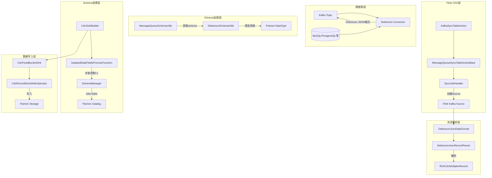
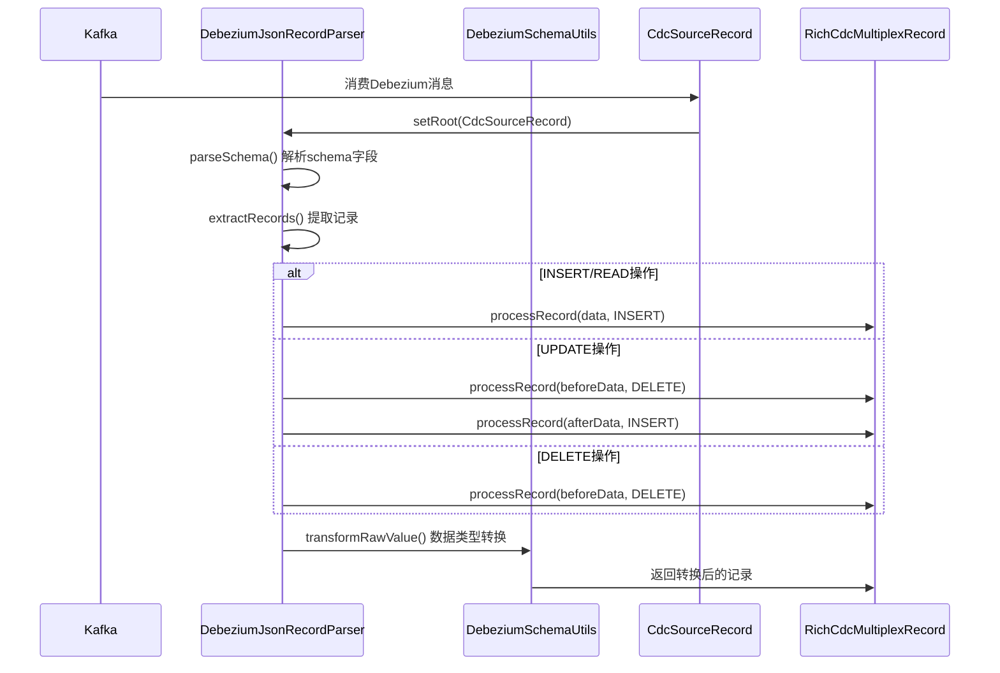
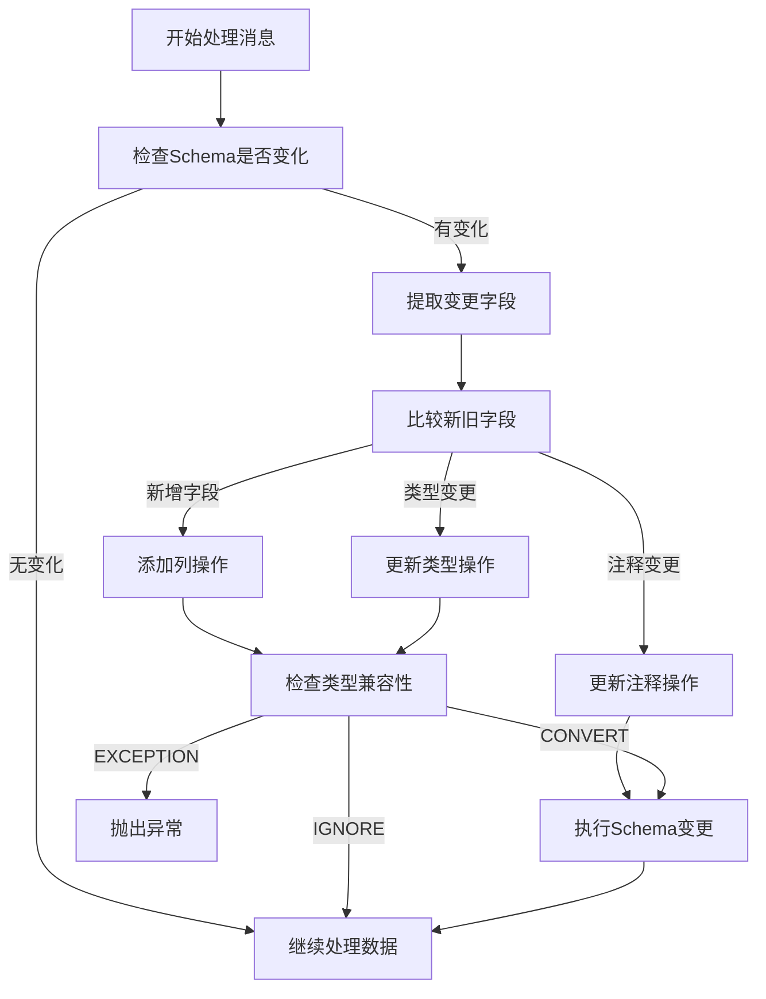
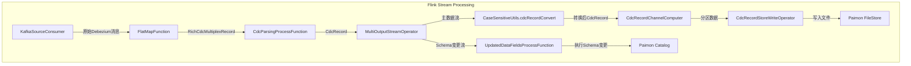
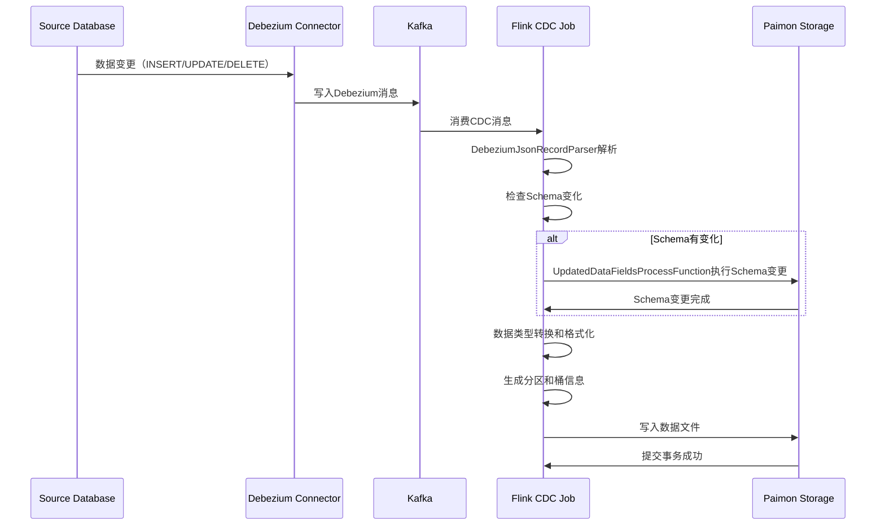

# Paimon Flink CDC Debezium 数据同步与 Schema 变更完整流程解析

## 概述

本文档详细解析了 Apache Paimon 如何通过 Flink CDC 同步 Kafka 中的 Debezium 消息到数据湖表，并完成整个 schema change 过程。该过程涉及消息解析、数据转换、schema 演进等多个关键环节。

## 整体架构流程图



## 核心组件分析

### 1. 目录结构与核心类

#### 1.1 Debezium 解析目录结构
```
paimon-flink-cdc/src/main/java/org/apache/paimon/flink/action/cdc/format/debezium/
├── DebeziumJsonDataFormat.java          # JSON格式数据格式定义
├── DebeziumJsonDataFormatFactory.java  # JSON格式工厂类
├── DebeziumJsonRecordParser.java        # JSON记录解析器（核心）
├── DebeziumAvroDataFormat.java          # Avro格式数据格式定义
├── DebeziumAvroDataFormatFactory.java  # Avro格式工厂类
├── DebeziumAvroRecordParser.java        # Avro记录解析器
├── DebeziumBsonDataFormat.java          # BSON格式数据格式定义
├── DebeziumBsonDataFormatFactory.java  # BSON格式工厂类
├── DebeziumBsonRecordParser.java        # BSON记录解析器
└── DebeziumSchemaUtils.java            # Schema处理工具类
```

#### 1.2 CDC Action 层次结构
```
KafkaSyncTableAction (入口类)
└── MessageQueueSyncTableActionBase (消息队列同步基类)
    └── SyncTableActionBase (表同步基类)
        └── SynchronizationActionBase (同步动作基类)
            └── Action (Flink Action接口)
```

### 2. Debezium 消息解析流程

#### 2.1 消息格式结构

Debezium JSON消息包含以下关键字段：

```json
{
  "schema": {  // Schema定义（可选）
    "fields": [
      {
        "field": "before",
        "fields": [
          {
            "field": "id",
            "type": "int32",
            "name": "int"
          }
        ]
      }
    ]
  },
  "payload": {  // 实际数据负载
    "before": null,  // 变更前数据
    "after": {       // 变更后数据
      "id": 1,
      "name": "test"
    },
    "op": "c",       // 操作类型：c=create, u=update, d=delete, r=read
    "ts_ms": 1234567890,
    "source": {
      "db": "test_db",
      "table": "test_table",
      "pkNames": ["id"]
    }
  }
}
```

#### 2.2 解析流程详解



#### 2.3 核心解析方法分析

**DebeziumJsonRecordParser.extractRecords()**:89-110
```java
public List<RichCdcMultiplexRecord> extractRecords() {
    String operation = getAndCheck(FIELD_TYPE).asText(); // 获取操作类型op
    List<RichCdcMultiplexRecord> records = new ArrayList<>();
    switch (operation) {
        case OP_INSERT:  // 'c'
        case OP_READE:   // 'r'
            processRecord(getData(), RowKind.INSERT, records);
            break;
        case OP_UPDATE:  // 'u'
            // UPDATE拆分为DELETE+INSERT
            processRecord(mergeOldRecord(getData(), getBefore(operation)), RowKind.DELETE, records);
            processRecord(getData(), RowKind.INSERT, records);
            break;
        case OP_DELETE:  // 'd'
            processRecord(getBefore(operation), RowKind.DELETE, records);
            break;
        default:
            throw new UnsupportedOperationException("Unknown record operation: " + operation);
    }
    return records;
}
```

**数据类型转换**: DebeziumSchemaUtils.transformRawValue():140-261
```java
public static String transformRawValue(
        String rawValue, String debeziumType, String className,
        TypeMapping typeMapping, Object origin, ZoneId serverTimeZone) {

    if (rawValue == null) return null;

    // 处理不同类型的转换逻辑
    switch (className) {
        case Bits.LOGICAL_NAME:
            // 处理BIT类型：小端序转大端序
            break;
        case Date.SCHEMA_NAME:
            // 处理DATE类型
            transformed = DateTimeUtils.toLocalDate(Integer.parseInt(rawValue)).toString();
            break;
        case Timestamp.SCHEMA_NAME:
            // 处理TIMESTAMP类型
            break;
        case ZonedTimestamp.SCHEMA_NAME:
            // 处理带时区的TIMESTAMP类型
            break;
        // ... 其他类型处理
    }
    return transformed;
}
```

### 3. Schema Change 处理机制

#### 3.1 Schema 变更检测流程



#### 3.2 Schema 变更类型

Paimon支持的Schema变更类型：

1. **添加列 (AddColumn)**
   - 支持向表中添加新列
   - 处理重复列添加的异常情况

2. **更新列类型 (UpdateColumnType)**
   - 字符串类型：char/varchar/text → 更长长度的字符串类型
   - 二进制类型：binary/varbinary/blob → 更长长度的二进制类型
   - 整数类型：tinyint/smallint/int/bigint → 更大范围的整数类型
   - 浮点类型：float/double → 更大范围的浮点类型

3. **更新列注释 (UpdateColumnComment)**
   - 更新列的描述信息

4. **更新表注释 (UpdateComment)**
   - 更新表的描述信息

#### 3.3 Schema 兼容性检查

**类型兼容性判断**: UpdatedDataFieldsProcessFunctionBase.canConvert():173-437

```java
public enum ConvertAction {
    CONVERT,    // 可以转换
    IGNORE,     // 忽略转换（同类型族但精度降低）
    EXCEPTION   // 抛出异常（不同类型族）
}
```

**兼容性规则**：
- 同类型族升级：支持（如INT→BIGINT）
- 不同类型族转换：抛出异常（如STRING→INT）
- Decimal类型变化：可通过配置控制是否允许
- 精度降低：忽略变更请求

#### 3.4 Schema 变更执行

**并发控制**：UpdatedDataFieldsProcessFunction并行度设置为1，避免并发Schema变更冲突

```java
// CdcSinkBuilder.build():123
schemaChangeProcessFunction.getTransformation().setParallelism(1);
schemaChangeProcessFunction.getTransformation().setMaxParallelism(1);
```

**变更执行**：通过Catalog.alterTable()执行具体的Schema变更

```java
// UpdatedDataFieldsProcessFunctionBase.applySchemaChange():106-162
if (schemaChange instanceof SchemaChange.AddColumn) {
    catalog.alterTable(identifier, schemaChange, false);
} else if (schemaChange instanceof SchemaChange.UpdateColumnType) {
    // 检查类型兼容性后执行
    catalog.alterTable(identifier, schemaChange, false);
}
```

### 4. Kafka到Paimon数据写入流程

#### 4.1 数据写入架构



#### 4.2 数据写入关键组件

**CdcSinkBuilder**: 核心Sink构建器
```java
public DataStreamSink<?> build() {
    // 1. 解析CDC记录
    SingleOutputStreamOperator<CdcRecord> parsed = input
        .process(new CdcParsingProcessFunction<>(parserFactory))
        .name("Side Output");

    // 2. 处理Schema变更（并行度=1）
    DataStream<Void> schemaChangeProcessFunction = SingleOutputStreamOperatorUtils
        .getSideOutput(parsed, CdcParsingProcessFunction.SCHEMA_CHANGE_OUTPUT_TAG)
        .process(new UpdatedDataFieldsProcessFunction(...))
        .name("Schema Evolution");

    // 3. 转换数据记录
    DataStream<CdcRecord> converted = CaseSensitiveUtils.cdcRecordConvert(catalogLoader, parsed);

    // 4. 根据bucket模式选择Sink
    switch (bucketMode) {
        case HASH_FIXED: return buildForFixedBucket(converted);
        case HASH_DYNAMIC: return new CdcDynamicBucketSink(...).build(converted, parallelism);
        case POSTPONE_MODE: return buildForPostponeBucket(converted);
        case BUCKET_UNAWARE: return buildForUnawareBucket(converted);
    }
}
```

**CdcFixedBucketSink**: 固定桶模式Sink
```java
private DataStreamSink<?> buildForFixedBucket(DataStream<CdcRecord> parsed) {
    FileStoreTable dataTable = (FileStoreTable) table;
    // 根据分区键进行分区
    DataStream<CdcRecord> partitioned = partition(
        parsed, new CdcRecordChannelComputer(dataTable.schema()), parallelism);
    return new CdcFixedBucketSink(dataTable).sinkFrom(partitioned);
}
```

#### 4.3 数据写入优化

1. **分区策略**：基于分区键进行数据分区，确保相同分区的数据在同一节点处理
2. **桶分配**：根据主键计算桶ID，避免热点问题
3. **写入优化**：使用批量写入和异步提交机制
4. **事务保证**：通过两阶段提交保证数据一致性

### 5. 完整数据同步流程

#### 5.1 端到端流程



#### 5.2 关键配置参数

**Kafka配置**：
```properties
# Kafka连接配置
bootstrap.servers=localhost:9092
topic=cdc-topic
group.id=paimon-cdc-group

# Debezium格式配置
value.format=debezium-json
debezium-json.schema.include=true
debezium-json.ignore.parse-errors=true
```

**Paimon配置**：
```properties
# 表配置
bucket=4
partition-keys=dt,hour
primary-keys=id

# Sink配置
sink.parallelism=4
sink.writer-buffer-size=64mb
sink.committer-threads=3
```

### 6. 性能优化与最佳实践

#### 6.1 性能优化策略

1. **并行度配置**：
   - Kafka Source并行度根据Topic分区数设置
   - Schema变更处理固定为1个并行度
   - 数据写入根据资源情况调整并行度

2. **内存管理**：
   - 合理配置Flink任务槽位和内存
   - 使用RocksDB作为状态后端
   - 开启增量检查点

3. **网络优化**：
   - 开启Kafka消息压缩
   - 合理设置网络缓冲区大小
   - 使用本地Kafka集群减少延迟

#### 6.2 故障处理

1. **Schema变更失败**：
   - 记录错误日志并继续处理数据
   - 支持手动修复后重试
   - 提供Schema兼容性检查工具

2. **数据写入失败**：
   - 支持 exactly-once 语义
   - 自动重试机制
   - 死信队列处理异常数据

3. **作业恢复**：
   - 基于Checkpoint状态恢复
   - 支持从最新偏移量或指定时间戳恢复
   - 分区感知的故障恢复

## 总结

Apache Paimon通过Flink CDC实现从Kafka Debezium消息到数据湖的完整数据同步流程，其核心特性包括：

1. **多种格式支持**：支持JSON、Avro、BSON等Debezium消息格式
2. **自动Schema演进**：智能检测和处理Schema变更，支持列添加、类型升级等
3. **类型转换**：完整的数据类型映射和转换逻辑，支持复杂的Debezium类型
4. **事务保证**：提供exactly-once语义，确保数据一致性
5. **高性能**：优化的分区和桶策略，支持高并发写入
6. **容错性**：完善的故障恢复和错误处理机制

该架构为构建实时数仓提供了可靠的数据同步解决方案，能够很好地适应源端Schema的持续演进需求。